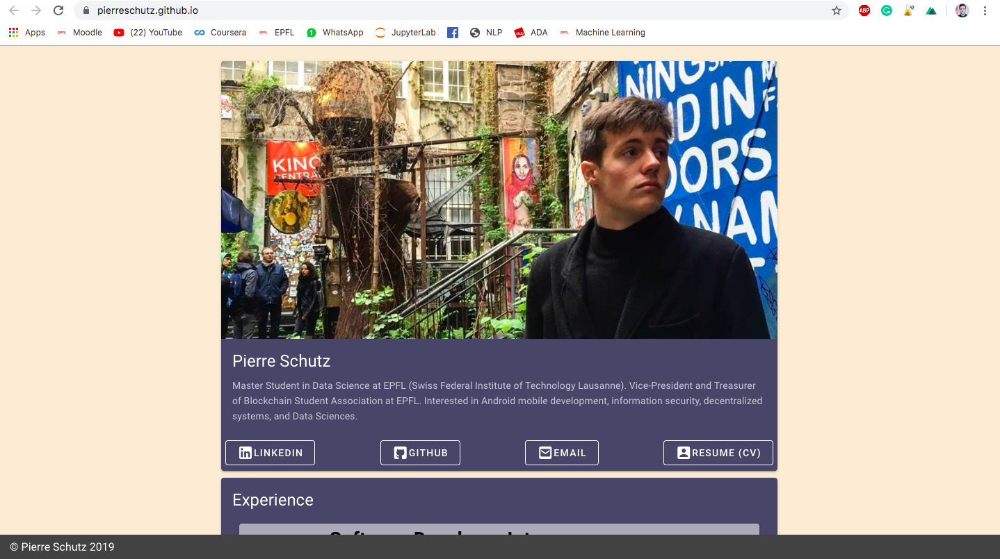

# Pierre Schutz - Website

This repository contains the Nuxt directory of my personnal website hosted on https://pierreschutz.github.io :

## Version 1



This website first version has been built in 24 hours the 7 October 2019.

Made from scratch using Vue.js and Nuxt.js

Feel free to use it as a template for your own website !

## Version 2

Currently (April 2021) take data visualisation class using D3. 
I am planning to add a fun world map visualization with all places I traveled to. 

I also plan to improve the general design with a dark and futuristic background.  

### Ressources: 
- http://bl.ocks.org/infographicstw/bfdaf2a075225043c967
- https://medium.com/greatescapeco/visualizing-tourist-destinations-by-d3-js-e6f861999725


## Build Setup

``` bash
# install dependencies
$ npm install

# serve with hot reload at localhost:3000
$ npm run dev

# build for production and launch server
$ npm run build
$ npm run start

# generate static project
$ npm run generate
```

For detailed explanation on how things work, check out [Nuxt.js docs](https://nuxtjs.org).

## Credits 

- [Background image](https://www.google.com/imgres?imgurl=https%3A%2F%2Fwallpaperaccess.com%2Ffull%2F806427.jpg&imgrefurl=https%3A%2F%2Fwallpaperaccess.com%2F4k-black&tbnid=wL4zm5QOymusQM&vet=12ahUKEwiK1c6m6JfwAhWsgU4HHTmRCsgQMygKegUIARDNAQ..i&docid=qCqT5yI6De8VGM&w=3840&h=2160&hl=en&safe=images&ved=2ahUKEwiK1c6m6JfwAhWsgU4HHTmRCsgQMygKegUIARDNAQ)


Vectorizing the background:

- Background image: https://pxhere.com/en/photo/1200487
- 1 Credit Free image vectorizer: https://www.vectorizer.io/ (New IP = New credit...)
